<p align="center">
  <strong>English</strong> |
  <a href="docs/i18n/README.zh-CN.md">简体中文</a> |
  <a href="docs/i18n/README.ja-JP.md">日本語</a> |
  <a href="docs/i18n/README.ko-KR.md">한국어</a> |
  <a href="docs/i18n/README.vi-VN.md">Tiếng Việt</a> |
  <a href="docs/i18n/README.pt-BR.md">Português</a> |
  <a href="docs/i18n/README.es.md">Español</a> |
  <a href="docs/i18n/README.de.md">Deutsch</a> |
  <a href="docs/i18n/README.fr.md">Français</a> |
  <a href="docs/i18n/README.hi.md">हिंदी</a>
</p>

<div align="center">

<a href="https://flowser.ai">
  
</a>

*Built by world-class engineers, for vibecoders at*<br>
*[flowser.ai](https://flowser.ai) — AI Agents with computers for GTM*

<br>

# vibecode-pro-max-kit

<br>

<p align="center">
  
  <br><br>
  <em>"Total Concentration — Spec Breathing, Tenth Form: the Vibe Flow never breaks."</em><br>
  <strong>— Tanjiro Kamado</strong>
</p>

*Drop this into any project. Your AI agent gets a complete plan-first dev process — 7 gated phases, self-healing check loops, and autopilot that runs start to finish without losing its place.*

<table align="center">
<tr>
<td width="50%" valign="top"><strong>📦 One-command install</strong><br>One <code>curl</code> line drops it into any project. It detects new vs. returning users and never overwrites your files.</td>
<td width="50%" valign="top"><strong>🌐 Works everywhere</strong><br>Any tech stack, any language, and any AI coding agent — Claude Code, Codex, Cursor, Windsurf, Copilot, and more.</td>
</tr>
<tr>
<td valign="top"><strong>🧭 RIPER-5 plan-first workflow</strong><br>7 gated phases (Research → Spec → Innovate → Plan → Validate → Execute → Update-Process) stop the agent from jumping straight to code.</td>
<td valign="top"><strong>🚀 Autopilot mode (quick / fast / full)</strong><br>Start a hands-free run at any phase with a single phrase. Three lanes match the ceremony to the risk.</td>
</tr>
<tr>
<td valign="top"><strong>🎯 <code>/goal</code> — the run-until-done token</strong><br>One copy-pasteable block keeps the agent running phase after phase without stopping — and resumes the run in a fresh session.</td>
<td valign="top"><strong>🔁 PVL + EVL self-healing loops</strong><br>Plan-check-fix and test-check-fix loops find gaps, fix them, and re-check on their own — up to 10 cycles each.</td>
</tr>
<tr>
<td valign="top"><strong>🔍 vc-autoresearch</strong><br>A reusable find-gaps → fix → repeat loop you can point at plans, tests, specs, docs, or evals.</td>
<td valign="top"><strong>🧪 Feasibility probes</strong><br>Test-before-you-build verdicts (VIABLE / NOT-VIABLE) before the agent commits to any design approach.</td>
</tr>
<tr>
<td valign="top"><strong>🎛️ Smart strategy picker</strong><br>Before each phase it weighs one agent vs. many vs. a coordinated team — with cost estimates — and picks the cheapest that fits.</td>
<td valign="top"><strong>🧮 Smart model use</strong><br>The expensive model only writes code; the cheaper model does everything else. Lower cost, same quality.</td>
</tr>
<tr>
<td valign="top"><strong>🤔 Intent clarification</strong><br>When a request is vague, the agent asks a few sharp questions up front instead of guessing and building the wrong thing.</td>
<td valign="top"><strong>🛡️ 36 validators</strong><br>Mechanical correctness checks — not opinions — guard the kit's own structure and catch drift before it ships.</td>
</tr>
<tr>
<td valign="top"><strong>🏗️ Phase programs</strong><br>Large projects are split into independent phases with quality gates between them, so big work doesn't fall apart.</td>
<td valign="top"><strong>🔀 Programs that reshape themselves</strong><br>As it learns, the agent inserts new phases, reorders work, and skips blocked steps — the plan adapts on the fly.</td>
</tr>
<tr>
<td valign="top"><strong>🧠 Never loses its place</strong><br>Progress notes are written to disk every phase, so a run survives a memory reset and picks up exactly where it left off.</td>
<td valign="top"><strong>📚 Self-improving project memory</strong><br>It learns your codebase on setup and keeps its own shared notes current after every feature ships, so docs never go stale.</td>
</tr>
<tr>
<td valign="top"><strong>⚡ Quick Fix + Fast Mode</strong><br>Light lanes for small changes skip the heavy ceremony, so a one-line fix stays a one-line fix.</td>
<td valign="top"><strong>🧱 Layered, auto-discovered skills</strong><br>Skills are organized in clear layers and discovered automatically — the agent always finds the right tool for the step.</td>
</tr>
<tr>
<td valign="top"><strong>🤖 15 agents · 33 skills · 10 hooks</strong><br>A full team of specialized agents, reusable skills, and safety hooks, all wired together out of the box.</td>
<td valign="top"><strong>🔄 Full kit lifecycle</strong><br>Install, setup, update, and publish are all one command each — keeping every project on the latest kit safely.</td>
</tr>
<tr>
<td valign="top"><strong>📝 SPEC — your plain-language sign-off</strong><br>Before any design, you state what to build in simple user stories — the cheapest place to catch a misunderstanding.</td>
<td valign="top"><strong>🎯 Always checks your intent</strong><br>Every later phase measures back against your SPEC: is what we're building actually what you asked for?</td>
</tr>
</table>

<p>
  <a href="https://github.com/withkynam/vibecode-pro-max-kit/stargazers"></a>
  <a href="https://github.com/withkynam/vibecode-pro-max-kit/network/members"></a>
  <a href="LICENSE"></a>
  <a href="https://github.com/withkynam/vibecode-pro-max-kit/graphs/contributors"></a>
  <a href="https://github.com/withkynam/vibecode-pro-max-kit/actions/workflows/validate.yml"></a>
  <a href="CHANGELOG.md"></a>
  
  
  
  
</p>

<p>
  <strong>The simplest, most flexible, team-friendly coding kit for</strong><br><br>
  <a href="https://github.com/anthropics/claude-code"></a>&nbsp;
  <a href="https://github.com/openai/codex"></a>&nbsp;
  <a href="https://cursor.com"></a>&nbsp;
  <a href="https://windsurf.com"></a><br>
  <a href="https://github.com/google-gemini/gemini-cli"></a>&nbsp;
  <a href="https://github.com/opencode-ai/opencode"></a>&nbsp;
  <a href="https://github.com/features/copilot"></a>
</p>

<p>
  <em>Works across any tech stack, any language, any project</em><br><br>
  <picture>
    <source media="(prefers-color-scheme: dark)" srcset="https://skillicons.dev/icons?i=ts%2Cjs%2Creact%2Cnextjs%2Cvue%2Cnuxt%2Csvelte%2Cangular%2Cnodejs%2Cexpress%2Cbun%2Cpython%2Cdjango%2Cflask%2Cfastapi&theme=dark&perline=15" />
    <source media="(prefers-color-scheme: light)" srcset="https://skillicons.dev/icons?i=ts%2Cjs%2Creact%2Cnextjs%2Cvue%2Cnuxt%2Csvelte%2Cangular%2Cnodejs%2Cexpress%2Cbun%2Cpython%2Cdjango%2Cflask%2Cfastapi&theme=light&perline=15" />
    
  </picture>
  <br>
  <picture>
    <source media="(prefers-color-scheme: dark)" srcset="https://skillicons.dev/icons?i=ruby%2Crails%2Cgo%2Crust%2Cjava%2Cspring%2Ckotlin%2Cswift%2Cphp%2Claravel%2Ccs%2Cdotnet%2Celixir%2Cgraphql%2Cprisma&theme=dark&perline=15" />
    <source media="(prefers-color-scheme: light)" srcset="https://skillicons.dev/icons?i=ruby%2Crails%2Cgo%2Crust%2Cjava%2Cspring%2Ckotlin%2Cswift%2Cphp%2Claravel%2Ccs%2Cdotnet%2Celixir%2Cgraphql%2Cprisma&theme=light&perline=15" />
    
  </picture>
  <br>
  <picture>
    <source media="(prefers-color-scheme: dark)" srcset="https://skillicons.dev/icons?i=supabase%2Cfirebase%2Cpostgres%2Cmongodb%2Credis%2Cdocker%2Ckubernetes%2Caws%2Cgcp%2Cazure%2Cvercel%2Ccloudflare%2Ctailwind%2Celectron&theme=dark&perline=15" />
    <source media="(prefers-color-scheme: light)" srcset="https://skillicons.dev/icons?i=supabase%2Cfirebase%2Cpostgres%2Cmongodb%2Credis%2Cdocker%2Ckubernetes%2Caws%2Cgcp%2Cazure%2Cvercel%2Ccloudflare%2Ctailwind%2Celectron&theme=light&perline=15" />
    
  </picture>
  <br>
  <p><em>Not just for show. When you run <code>vc-setup</code>, agents scan your codebase,<br>
  detect your stack, and build project-specific knowledge groups that every skill reads before it works.<br>
  Other harnesses lock agents to one language — <code>rust-review-agent</code>, <code>python-linter</code> — useless elsewhere.<br>
  This one adapts to any combination above and builds up knowledge as you ship.</em></p>
</p>

</div>

---

## ⚡ Get Started — One Command, 30 Seconds

> **Prerequisites:** Node.js ≥ 22, git, bash (macOS / Linux / WSL / **Git Bash**; on Alpine: `apk add bash`).
>
> **Windows:** the installer is a bash script — run it inside **Git Bash** (ships with [Git for Windows](https://git-scm.com/download/win)) or **WSL**, *not* PowerShell or `cmd.exe`. Both work out of the box: the installer detects Windows shells and, when symlinks aren't permitted, automatically falls back to copying (install still completes). For true symlinks (so Codex auto-reflects `vc-update` changes), [enable Developer Mode](https://learn.microsoft.com/en-us/windows/apps/get-started/enable-your-device-for-development).

**There is only one command, and it works for everyone.** Run it inside your project folder. It detects whether you are a new or returning user, installs safely without overwriting your files, and then *tells you the exact next thing to say.*

```bash
curl -fsSL https://raw.githubusercontent.com/withkynam/vibecode-pro-max-kit/main/install.sh | bash
```

When it finishes, it prints one of two messages — **read the bottom of the output and do exactly what it says:**

<table>
<tr>
<td width="50%" valign="top">
<h3>🆕 Fresh project</h3>
Installer detects no harness and prints:
<br><br>
<code>Next: Run: claude → Say: "Run vc-setup"</code>
<br><br>
<strong>→ Open your agent and say <code>Run vc-setup</code></strong>
<br><br>
<sub>vc-setup detects your tech stack, creates the <code>process/</code> folder, scans your codebase, and fills in your <em>real</em> architecture, conventions, and test commands — a conversation, not a checklist.</sub>
</td>
<td width="50%" valign="top">
<h3>🔄 Existing harness (upgrade)</h3>
Installer detects a prior install and prints:
<br><br>
<code>Next (upgrade detected): Run: claude → Say: "Run vc-update"</code>
<br><br>
<strong>→ Open your agent and say <code>Run vc-update</code></strong>
<br><br>
<sub>vc-update pulls the latest version and, if it finds old-format plans or folders, gives you a ready-to-paste prompt to finish the move with <strong>zero data loss</strong>. Your <code>process/</code> is never touched.</sub>
</td>
</tr>
</table>

> 💡 **You never have to guess the command.** `install.sh` routes you: fresh → `vc-setup`, upgrade → `vc-update`. Re-running install is always safe — it never breaks things. **Codex users:** run `/vc-setup` (or `/vc-update`) instead of saying it in chat.

<br>

<details>
<summary><strong>📦 What install puts on disk (non-destructive)</strong></summary>

<br>

```
your-project/
├── .claude/
│   ├── agents/              # 🤖 15 agent definitions (.md)
│   ├── skills/              # ⚡ 33 skills (each a dir with SKILL.md)
│   └── hooks/               # 🪝 10 lifecycle hooks (.cjs / .mjs)
├── .codex/agents/           # 🔄 Mirrored agents for Codex
├── .agents/skills →         # 🔗 Symlink to .claude/skills (Codex discovery)
├── CLAUDE.md                # 📋 Orchestrator + routing rules
├── AGENTS.md                # 📖 Agent + skill registry (cross-tool)
└── process/
    └── development-protocols/  # 📜 22 shared workflow docs (seeded by install)
                                #    context/, plans, features → built by vc-setup
```

- **Non-destructive.** Your existing `.claude/skills/`, `.claude/agents/`, `process/`, and `settings.json` are never wiped. Only kit-owned files are written or updated.
- **Existing config?** Backed up to `.vibecode-backup/`; your `settings.json` is restored afterward.
- **Existing `CLAUDE.md`?** Backed up as `CLAUDE.md.pre-vibecode`.
- **Existing `process/`?** Never touched by install — `vc-setup` / `vc-update` migrate it interactively, showing you the diff first.

> **One-time first-install caveat:** if you have custom skills/agents whose names start with `vc-` (the reserved kit namespace) and have *never* run install before, the stale-removal step may flag them. After install, run `ls .claude/skills/ .claude/agents/` to confirm. Use a non-`vc-` prefix (`my-`, `team-`, `proj-`) for your own additions to avoid this entirely.

</details>

<details>
<summary><strong>🤖 Prefer to drive setup from your agent? (full prompt)</strong></summary>

<br>

> Open Claude Code or Codex **with your project folder as the working directory**, then paste:

```
First, install the vibecode-pro-max-kit agent harness by running this command:

curl -fsSL https://raw.githubusercontent.com/withkynam/vibecode-pro-max-kit/main/install.sh | bash

After install completes, run vc-setup and follow the full interactive flow:

1. DETECT — Read package.json (or go.mod, Cargo.toml, pyproject.toml, etc.), detect my
   stack: framework, package manager, monorepo structure, test framework, database, auth.
   Also check for any existing .claude/, process/, or context files.
2. SHOW ME WHAT YOU FOUND — Summarize detection and wait for me to confirm. If this is an
   existing project, tell me what looks good vs what could be improved.
3. ASK ME ABOUT THE PROJECT — Have a real conversation. Ask follow-ups, probe anything
   vague, keep going until you genuinely understand it. Summarize back and confirm.
4. SCAFFOLD — Create the process/ directory. If process/ already exists, show me the plan
   and wait for approval. Never silently move or delete my files.
5. STUDY — Deep-scan and populate process/context/all-context.md with REAL content: repo
   structure, stack + versions, patterns, import aliases, env vars, routes, schema, tests.
   No placeholder text.
6. VALIDATE — Run all validation checks to confirm everything is wired correctly.

Rules: read and preserve good existing context; show me a summary before each major change
and wait for my OK; never create empty placeholder files; ask before reorganizing.
```

</details>

<details>
<summary>Table of Contents</summary>

- [At a Glance](#-at-a-glance) · [The Problem](#-the-problem) · [The Fix](#-the-fix)
- [Vibe Coding Revolution](#the-vibe-coding-revolution) · [Who Is This For](#who-is-this-for) · [How This Compares](#how-this-compares) · [What Makes This Different](#-what-makes-this-different)
- [How It Works: The Coordinator](#-how-it-works--the-coordinator) · [The RIPER-5 Lifecycle](#-the-riper-5-lifecycle) · [Intent Clarification](#-intent-clarification)
- [The Two Quality Loops (PVL + EVL)](#-the-two-quality-loops--pvl--evl) · [Strategy Compare + Model Policy](#-strategy-compare--model-policy) · [Autopilot Mode](#-autopilot-mode--hands-free-riper-5) · [Feasibility Probes + Validators](#-feasibility-probes--the-validator-safety-net)
- [Built-in Safety Systems](#-built-in-safety-systems) · [Pre-Implementation Intelligence](#-pre-implementation-intelligence) · [Quality Pipeline](#-quality-pipeline--built-into-execution)
- [Plan Lifecycle](#-the-plan-lifecycle) · [Phase Programs](#-phase-programs--large-projects-that-dont-fall-apart) · [Context Groups](#-context-groups) · [Feature Folders](#-feature-folders) · [Skill Layers](#-skill-layers) · [Self-Improving Memory](#-self-improving-project-memory)
- [What's Inside](#-whats-inside) · [Quick Fix + Fast Mode](#-quick-fix--fast-mode) · [Kit Lifecycle](#-kit-lifecycle-install--setup--update--publish) · [Contributing](#contributing)

</details>

---

## 🎁 At a Glance

<table>
<tr>
<td align="center" width="25%" valign="top"><h1>🤖</h1><h3>15</h3><strong>Agents</strong><br><sub>One per phase + 6 specialist agents</sub></td>
<td align="center" width="25%" valign="top"><h1>⚡</h1><h3>33</h3><strong>Skills</strong><br><sub>20 workflow + 13 helper, matched by keyword</sub></td>
<td align="center" width="25%" valign="top"><h1>🪝</h1><h3>10</h3><strong>Hooks</strong><br><sub>Safety rails + automatic context loading</sub></td>
<td align="center" width="25%" valign="top"><h1>📜</h1><h3>22</h3><strong>Protocols</strong><br><sub>Shared rules every agent follows</sub></td>
</tr>
<tr>
<td align="center" width="25%" valign="top"><h1>🛡️</h1><h3>36</h3><strong>Validators</strong><br><sub>Automated checks that catch errors before they ship</sub></td>
<td align="center" width="25%" valign="top"><h1>🔧</h1><h3>7</h3><strong>Tools</strong><br><sub>Claude Code · Codex · Cursor · Windsurf · Antigravity · OpenCode · Copilot</sub></td>
<td align="center" width="25%" valign="top"><h1>🌍</h1><h3>10</h3><strong>Languages</strong><br><sub>EN · 中文 · 日本語 · 한국어 · VI · PT · DE · FR · ES · हिन्दी</sub></td>
<td align="center" width="25%" valign="top"><h1>⚡</h1><h3>30s</h3><strong>Install</strong><br><sub>One command, then your agent guides the rest</sub></td>
</tr>
<tr>
<td align="center" width="25%" valign="top"><h1>🛩️</h1><strong>Autopilot</strong><br><sub>3 lanes (quick / fast / full) — start at any phase, runs start to finish without stopping</sub></td>
<td align="center" width="25%" valign="top"><h1>📌</h1><strong>/goal blocks</strong><br><sub>Short copy-pasteable texts that resume hands-free runs across sessions after a reset</sub></td>
<td align="center" width="25%" valign="top"><h1>🔁</h1><strong>vc-autoresearch</strong><br><sub>Find-gaps → fix → repeat loop (shared tool for plans, tests, and evals)</sub></td>
<td align="center" width="25%" valign="top"><h1>🔬</h1><strong>Feasibility probes</strong><br><sub>Test-before-you-build verdicts (VIABLE / NOT-VIABLE) before locking in a design</sub></td>
</tr>
</table>

---

## 🔥 The Problem

You ask Claude to "add webhook support." It immediately starts writing code. No questions about your architecture. No check on existing patterns. No plan. You get 400 lines that don't fit your codebase, and you spend an hour fixing it.

**But that's just the surface.** The deeper problems hit harder:

<table>
<tr>
<td width="50%" valign="top">
<h1>🧠</h1>
<strong>Context dies every session</strong><br><br>
Your agent forgets everything it learned. Same mistakes, same questions, every time. No memory, no compounding knowledge.
</td>
<td width="50%" valign="top">
<h1>📄</h1>
<strong>Docs go stale instantly</strong><br><br>
You wrote great context docs last week. They're already outdated. Nothing auto-updates them as the codebase evolves.
</td>
</tr>
<tr>
<td width="50%" valign="top">
<h1>💥</h1>
<strong>Big tasks collapse mid-way</strong><br><br>
The context window fills, state is lost, the agent starts hallucinating. You restart from scratch on hour 3.
</td>
<td width="50%" valign="top">
<h1>🤝</h1>
<strong>No specs, no review, no collaboration</strong><br><br>
Your PM can't review what the agent is about to build. There is no written plan to share, discuss, or approve before code is written.
</td>
</tr>
<tr>
<td width="50%" valign="top">
<h1>🎭</h1>
<strong>Architecture decisions are hallucinated</strong><br><br>
The agent invents patterns instead of researching how other codebases solved the same problem.
</td>
<td width="50%" valign="top">
<h1>🚀</h1>
<strong>Nothing verifies "done"</strong><br><br>
The agent says "all tests pass" — but it never independently re-ran them. You find out in production.
</td>
</tr>
</table>

**Your agent has intelligence but no process, no memory, and no way to collaborate with your team.** Whether you're a developer, a PM, or a CEO who just started vibe coding — this hits everyone the same way, and the fix is the same: **give your agent a real development process.**

---

## 🛠️ The Fix

This kit installs a complete development system into your project — not just a `CLAUDE.md`, but **15 specialized agents, 33 skills, 10 hooks, and 22 protocols** — with a step-locked workflow that makes your agent **understand before it builds, and prove before it ships.**

<br>

<table>
<tr>
<td align="center" width="50%" valign="top"><h1>📋</h1><strong>Plan-first approach</strong><br><br><sub>PMs and devs review the same written plan before any code is written</sub></td>
<td align="center" width="50%" valign="top"><h1>🔄</h1><strong>Self-improving knowledge</strong><br><br><sub>Updates itself every time a feature ships — docs never go stale</sub></td>
</tr>
<tr>
<td align="center" width="50%" valign="top"><h1>⚡</h1><strong>Hands-free execution</strong><br><br><sub>Survives session resets — runs for hours, not minutes</sub></td>
<td align="center" width="50%" valign="top"><h1>🧬</h1><strong>Architecture research</strong><br><br><sub>Studies real codebases before making design decisions</sub></td>
</tr>
<tr>
<td align="center" width="50%" valign="top"><h1>✅</h1><strong>Two quality checks</strong><br><br><sub>Plans are checked before coding; tests are re-run independently after</sub></td>
<td align="center" width="50%" valign="top"><h1>🧭</h1><strong>Smart knowledge routing</strong><br><br><sub>Loads only what is relevant — not your whole knowledge base every time</sub></td>
</tr>
</table>

<br>

### The full RIPER-5 flow — 7 phases, every step gated

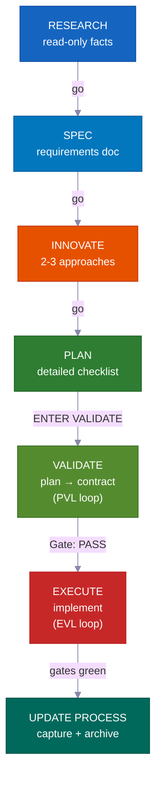

**In interactive mode**, each phase waits for your "go" before it moves on — you stay in the loop at every step. **In autopilot or /goal mode**, you give approval once up front, then the system drives itself all the way to done. It stops only for three specific hard stops listed below. **VALIDATE** and the post-EXECUTE re-test are not optional — they are hard gates that block bad work from shipping — and they run automatically in both modes.

---

## The Vibe Coding Revolution

<div align="center">
<h3><em>"The hottest new programming language is English."</em></h3>
<strong>— Andrej Karpathy</strong>
</div>

<br>

**Vibe coding changed who can build software. Plan-first development changes what they can ship.**

<table>
<tr>
<td align="center" width="50%"><h3>63%</h3><sub>of vibe coding users are <strong>NOT</strong> developers</sub></td>
<td align="center" width="50%"><h3>16.2M</h3><sub>citizen developers worldwide<br>(38% YoY growth)</sub></td>
</tr>
<tr>
<td align="center" width="50%"><h3>$4.7B</h3><sub>vibe coding market<br>growing 38% annually</sub></td>
<td align="center" width="50%"><h3>25%</h3><sub>of YC W25 startups had 95%+ AI-generated codebases</sub></td>
</tr>
</table>

Most tools help you start a project. This kit helps you **finish it** — with plans your team can review, knowledge that never goes stale, and safety checks that catch mistakes before they ship.

---

## Who Is This For?

<div align="center">
<h3><em>"The point isn't who typed it. It's what shipped."</em></h3>
<strong>— Garry Tan, YC</strong>
</div>

<br>

<table>
<tr>
<td width="50%" valign="top">
<h1>🧑‍💼</h1>
<strong>CEO / Founder</strong><br><br>
<em>"Build me a SaaS with auth, billing, and a landing page"</em><br><br>
The agent researches your stack, writes an architecture plan you can review, implements with tests, and captures every decision for your technical co-founder to audit later.
</td>
<td width="50%" valign="top">
<h1>📊</h1>
<strong>Product Manager</strong><br><br>
<em>"Create a dashboard showing MRR, churn, and growth metrics"</em><br><br>
It generates a PRD-style SPEC, gets your approval before writing code, implements to spec, and archives the plan as searchable project history.
</td>
</tr>
<tr>
<td width="50%" valign="top">
<h1>🎨</h1>
<strong>Designer</strong><br><br>
<em>"Match this Figma screenshot pixel-perfect"</em><br><br>
The design-aware agent analyzes your mockup, implements component-by-component with your design tokens, and spawns visual comparison checks.
</td>
<td width="50%" valign="top">
<h1>⚙️</h1>
<strong>Engineer</strong><br><br>
<em>"Refactor the auth module to support RBAC with zero downtime"</em><br><br>
It researches your current auth code and how other codebases solved RBAC, writes a migration plan that maps which files could be affected, then builds it safely with rollback notes.
</td>
</tr>
</table>

---

## How This Compares

| Feature | vibecode-pro-max-kit | Superpowers | GSD | gstack |
|---------|---------------------|-------------|-----|--------|
| Plan-first lifecycle | Full RIPER-5 (research → spec → innovate → plan → validate → execute → update) | Mandatory workflows | Context-rot fix | Partial |
| Step-locked safety | Agent tools are restricted per phase (read-only research, no writing in innovate) | Skill-based constraints | Phase separation | None |
| Quality check loops | **Two** — PVL (check the plan) + EVL (independently re-run tests) | Per-skill | None automatic | None |
| Multi-tool support | 7 tools via `AGENTS.md` + `SKILL.md` open standards | Claude Code plugin | 14 runtimes | 1 tool |
| Auto-improving knowledge | Topic-grouped knowledge, updated after every feature | Plugin memory | Disk-persisted state | Manual |
| Team collaboration | Shared plans, specs, and review files | Solo | Solo | Solo |
| Skills system | 33 auto-discovered, keyword-matched at every prompt | 86 composable skills | Meta-prompting | 23 role tools |
| Large multi-phase projects | Umbrella plans + per-phase inner loop with regression checks | Single task | Single task | Single task |
| Hands-free mode | Autopilot (3 lanes) + standing `/goal` consent | Manual | Manual | Manual |
| Installation | 30s `curl` + auto-routed setup | Plugin marketplace | npx one-liner | git clone |

> **On runtime breadth:** GSD supports 14 runtimes. We support 7 deeply — with full agent harnesses, skill discovery, and lifecycle hooks on every platform. Breadth vs. depth: your choice.

---

## ⚡ What Makes This Different

<table>
<tr>
<td width="50%" valign="top">
<h1>🔒</h1>
<strong>Step-Locked Tool Restrictions</strong><br><br>
Your agent literally <strong>cannot</strong> write code during research. RESEARCH is read-only, INNOVATE has no Write, PLAN/VALIDATE write only to <code>process/</code>. <strong>Real capability limits</strong>, not just suggestions.
</td>
<td width="50%" valign="top">
<h1>🎯</h1>
<strong>The Lead Agent Never Touches Code</strong><br><br>
The coordinator routes, monitors, and drives loops — it <strong>never edits source files or runs tests itself</strong>. Every edit and every test run happens inside a dedicated sub-agent. No hidden work.
</td>
</tr>
<tr>
<td width="50%" valign="top">
<h1>🔍</h1>
<strong>Automatic Skill Discovery</strong><br><br>
Before handling any request, it scans <strong>33 skills</strong> and matches keywords. Say "add webhook support" and <code>vc-security</code> + <code>vc-scenario</code> are pulled in automatically.
</td>
<td width="50%" valign="top">
<h1>💾</h1>
<strong>Survives Session Resets</strong><br><br>
Plans, reports, knowledge docs, and learnings all live on disk. The startup hook restores approval gates after a session reset. <strong>Nothing is lost.</strong>
</td>
</tr>
<tr>
<td width="50%" valign="top">
<h1>🛡️</h1>
<strong>Self-Policing Step Guard</strong><br><br>
When the agent is about to skip a required step, it stops itself: <em>"PHASE JUMPING PREVENTED."</em> A <strong>built-in guard against shortcuts</strong>.
</td>
<td width="50%" valign="top">
<h1>🔄</h1>
<strong>Works Across 7 AI Coding Tools</strong><br><br>
Two open standards — <code>AGENTS.md</code> and <code>SKILL.md</code> — mean <strong>zero adapters, zero plugins.</strong> Start in Claude Code, switch to Cursor, continue in Codex.
</td>
</tr>
</table>

---

## 🧭 How It Works — The Coordinator

Your main session is a **coordinator** (called the orchestrator), not a worker. It does four things and nothing else:

```
Your request
  → Step 0: Skill Discovery (scan 33 skills, match keywords, attach candidates)
  → Detect intent (feature / bug / question / refactor / UI) + score ambiguity
  → Route to the right agent in a fresh context window
  → Monitor: step compliance, status codes, loop driving
```

<table>
<tr>
<td width="50%" valign="top">
<h1>🧑‍✈️</h1>
<strong>It delegates, never implements</strong><br><br>
Research → <code>vc-research-agent</code>. Plan → <code>vc-plan-agent</code>. Code → <code>vc-execute-agent</code>. The coordinator hands off the right context and waits — it never does the actual work itself.
</td>
<td width="50%" valign="top">
<h1>🚫</h1>
<strong>No hidden execution — ever</strong><br><br>
The moment a plan with an agreed checklist exists, "ENTER EXECUTE MODE" <strong>always</strong> launches <code>vc-execute-agent</code>. Even a one-line fix goes through it. Tests run only inside a dedicated <code>vc-tester</code>. This holds regardless of change size.
</td>
</tr>
<tr>
<td width="50%" valign="top">
<h1>📨</h1>
<strong>Clear status codes, not vague signals</strong><br><br>
Every sub-agent ends with one of: <code>DONE</code> · <code>DONE_WITH_CONCERNS</code> · <code>BLOCKED</code> · <code>NEEDS_CONTEXT</code>. The coordinator never ignores a blocker and never retries the same blocked approach three times.
</td>
<td width="50%" valign="top">
<h1>🔁</h1>
<strong>It drives the fix loops</strong><br><br>
Sub-agents run once, report a result, and stop. Only the coordinator re-launches them. It drives both the PVL (plan-check-fix) and EVL (test-check-fix) loops and owns all tracking.
</td>
</tr>
</table>

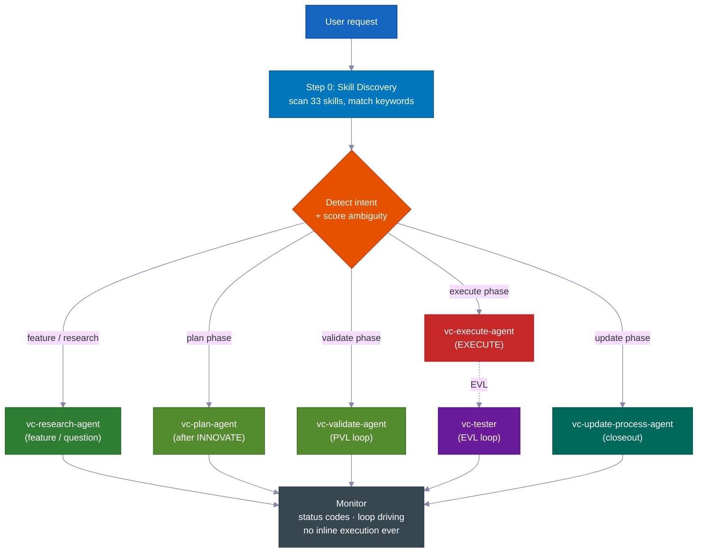

> **Why this matters:** an agent that can both decide *and* secretly edit will find ways to skip the plan. By separating the coordinator from the workers (sub-agents), the process becomes structurally honest — the only way to write code is to go through the required steps.

---

## 📊 The RIPER-5 Lifecycle

| Phase | What happens | Agent | You say |
|-------|-------------|-------|---------|
| 🔍 **RESEARCH** | Read-only fact gathering — codebase + web. Never modifies files. | `vc-research-agent` | *(auto on feature requests)* |
| 📝 **SPEC** | Product-discovery requirements doc — user stories, acceptance criteria, out-of-scope — for **your review before any design**. | `vc-spec-agent` | `go` / `ENTER SPEC MODE` |
| 💡 **INNOVATE** | Explore 2-3 approaches with trade-offs. Decision summary (chosen + rejected + why). | `vc-innovate-agent` | `go` |
| 📋 **PLAN** | Write the detailed spec: touchpoints, public contracts, which files it can touch, verification evidence, resume handoff. | `vc-plan-agent` | `go` |
| ✅ **VALIDATE** | Turn the plan into an agreed checklist (V1–V7 checkpoints). Verdict: **PASS / CONDITIONAL / BLOCKED**. Runs the PVL loop. | `vc-validate-agent` | `ENTER VALIDATE MODE` |
| ⚡ **EXECUTE** | Implement *exactly* the plan. Progress notes to the phase report, deviation protocol, self-review. Then the EVL loop re-runs the checkpoints. | `vc-execute-agent` | `ENTER EXECUTE MODE` |
| 🧠 **UPDATE PROCESS** | Capture learnings, update context, archive plan, write closeout packet. | `vc-update-process-agent` | *(recommended after non-trivial work)* |

> 📝 **Why SPEC is its own phase:** most harnesses jump from "understand" to "design." Inserting a product-discovery SPEC step means *you* (or your PM) sign off on **what** is being built — in plain user stories and acceptance criteria — *before* the agent debates **how**. It is the cheapest possible place to catch a misunderstanding. (Inside a phase program's inner loop, SPEC is skipped — the umbrella SPEC governs all phases.)
>
> **The SPEC is the measuring stick.** It states the expected behavior in simple terms you can scan in a minute. Every phase after it — Innovate, Plan, Validate, Execute — checks back against it and asks the same question: *is what we are building actually what you asked for?* When the work starts to drift, the SPEC is what catches it.

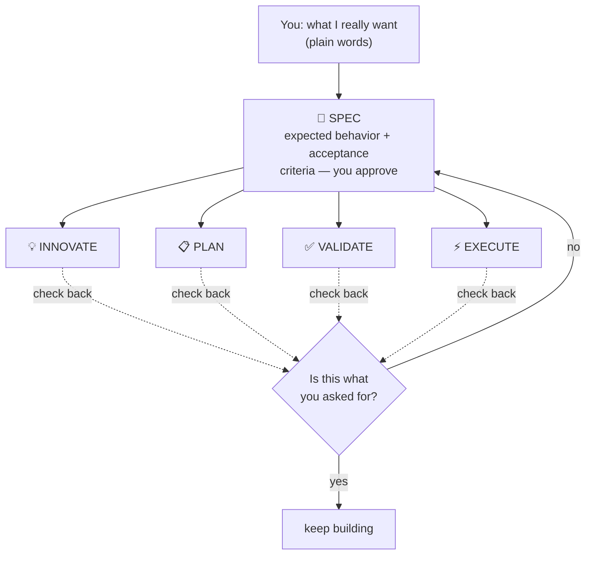

<br>

### 💻 Example sessions

```
# 🆕 Feature request
You: "add webhook support to the API"
→ Skill discovery surfaces: vc-scenario, vc-security
→ research-agent gathers context (read-only, can't touch code)
→ "go" → spec-agent writes requirements doc → you approve
→ "go" → innovate-agent compares approaches → decision summary
→ "go" → plan-agent writes the plan, listing which files it will touch
→ "ENTER VALIDATE MODE" → validate-agent gates the plan (PVL loop) → Gate: PASS
→ "ENTER EXECUTE MODE" → execute-agent implements → tester re-runs gates (EVL) → reviewer → git-manager
→ Closeout packet: what changed, what's verified, recommended next step
```

```
# 🐛 Bug fix
You: "login redirect is broken"
→ Routes to vc-debugger → gathers evidence FIRST → 2-3 competing hypotheses
→ Systematically eliminates each → root cause with proof chain
→ execute-agent implements the fix → EVL re-test → quality pipeline
```

```
# ⏩ Fast mode
You: "ENTER FAST MODE - add rate limiting middleware"
→ Compressed RESEARCH + SPEC + INNOVATE + PLAN + VALIDATE in one pass
→ Mandatory safety pause after VALIDATE → you review → "ENTER EXECUTE MODE"
```

```
# 🤖 Autopilot (hands-free)
You: "autopilot full: build a notifications system"
→ ONE consolidated clarification round → provisional /goal block (standing consent)
→ Drives the full RIPER-5 sequence autonomously, pausing only on hard stops
```

```
# 🏗️ Large program
You: "build a full testing platform"
→ Umbrella plan + phase plans in a feature folder
→ Each phase inner loop: research → innovate → plan → PVL → execute → EVL → update
→ Progress survives context compaction — durable reports on disk
```

---

## 🎯 Intent Clarification

Before routing, the lead agent scores your request's ambiguity on **4 binary signals (0–4)** and picks a tier. It asks questions *only when they would actually change what it does.*

| Tier | When | Behavior |
|---|---|---|
| **Tier 0** — silent auto-route | Score 0–1, or you said "go" / "just do it", or resuming a plan | Routes immediately, no questions |
| **Tier 1** — inline summary | Score 2 | States its understanding + chosen route in one line, then proceeds |
| **Tier 2** — questions | Score 3+ | Asks focused multiple-choice questions before routing |

> 🧠 **Two rounds max.** If still unclear after Tier 2, it asks one final plain question, then defaults to research with the narrowest reasonable scope. It never loops clarification forever. After RESEARCH, it re-checks intent — if research shows the request was different from what was assumed, it re-presents; if confirmed, it proceeds without re-asking.

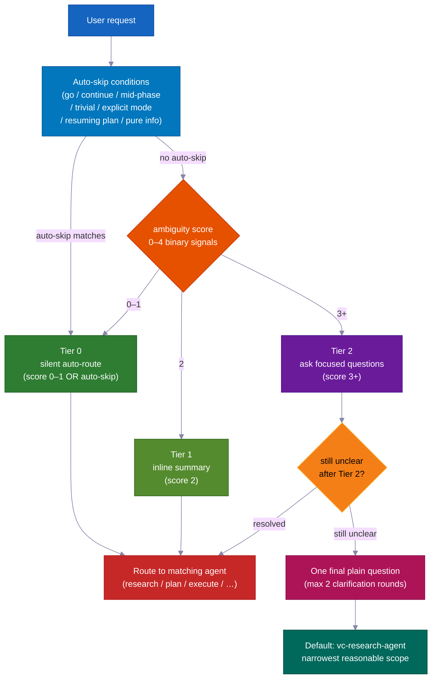

---

## ✅ The Two Quality Loops — PVL + EVL

Most harnesses check *once*, if at all. This one wraps EXECUTE in **two independent loops** — one before code is written, one after.

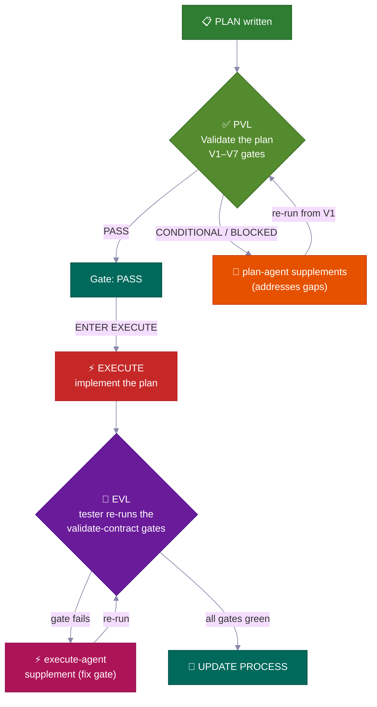

<table>
<tr>
<td width="50%" valign="top">
<h3>📋 PVL — Plan-Validate-Fix</h3>
Before EXECUTE, <code>vc-validate-agent</code> runs the plan through <strong>V1–V7 checkpoints</strong> — splitting the work across several agents to cover infra, test coverage, breaking changes, security, and per-section feasibility. A first-pass <strong>CONDITIONAL</strong> or <strong>BLOCKED</strong> is never the end — it routes back to <code>vc-plan-agent</code> to update the plan, then re-checks from V1.
<br><br>
<sub>Tracked by <code>vc-autoresearch</code> (domain: plan) — a find-gaps-and-fix loop. 10-cycle cap. Plateau detection. Only <strong>Gate: PASS</strong> (or a CONDITIONAL you explicitly accept) unlocks EXECUTE.</sub>
</td>
<td width="50%" valign="top">
<h3>🧪 EVL — Execute-Validate-Fix</h3>
After EXECUTE reports done — <strong>even when it claims all checkpoints are green</strong> — the lead agent <strong>always</strong> spawns <code>vc-tester</code> to independently re-run the exact agreed-checklist test commands. A failing checkpoint routes to a scoped <code>vc-execute-agent</code> fix, then re-tests.
<br><br>
<sub>Tracked by <code>vc-autoresearch</code> (domain: tests). 10-cycle cap. The execute-agent's own internal "iterate until green" loop <strong>never</strong> substitutes for this independent confirmation.</sub>
</td>
</tr>
</table>

> 💎 **The verdict ladder:** **PASS** → proceed · **CONDITIONAL** → fixable gaps; the loop fires (or you accept them on record) · **BLOCKED** → a deeper problem; returns to PLAN (under autopilot: the gap goes to a backlog and the run continues).

### 🔁 vc-autoresearch — Shared Loop Engine

Both PVL and EVL use the same tracking layer: **`vc-autoresearch`** — a find-gaps → fix → repeat loop. The lead agent drives the loop — it owns the round counter, per-round reports, TSV log, and plateau/cap/regression checks. Worker agents are fire-and-forget: they return a result and stop. No agent re-spawns itself or spawns another phase agent.

The same engine can run on its own: "harden this spec", "fix all lint", "improve test coverage", "improve these docs" — any repeated find-gaps-and-fix task across 6 domains (spec · tests · ux · docs · plan · errors).

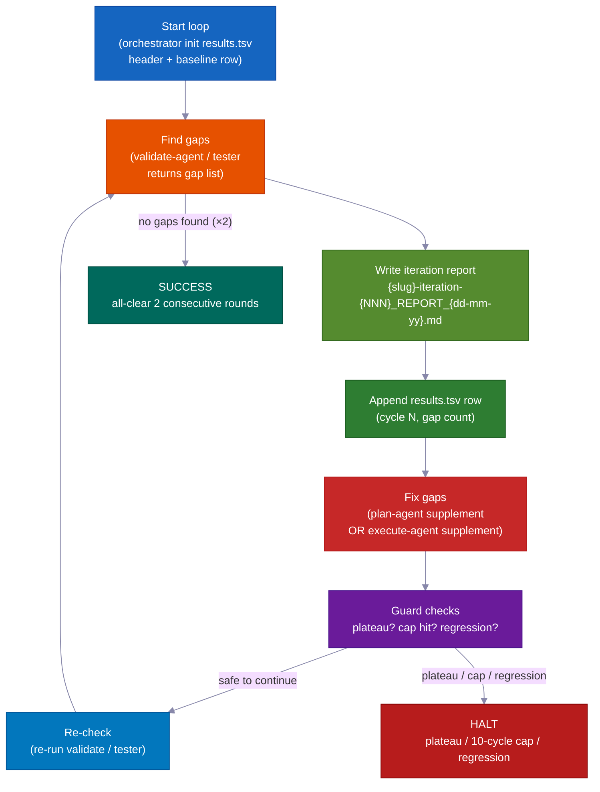

| Mode | Does | Stops when |
|---|---|---|
| `vc-autoresearch` (core) | find gaps → fix → repeat | no gaps found OR metric goal hit |
| `vc-autoresearch:probe` | 8 personas interrogate the corpus until saturation | no new constraints for 3 rounds |
| `vc-autoresearch:reason` | adversarial debate with blind judges | judges converge or iteration cap |
| `vc-autoresearch:evals` | analyze TSV results — trends, plateaus, recommendations | analysis only |

**Stop conditions:** SUCCESS (all-clear two rounds in a row) · HALT_PLATEAU (no progress for 3 rounds) · HALT_CAP (10-round hard limit) · HALT_REGRESSION (a check that was passing now fails).

---

## 👥 Strategy Compare + Model Policy

At **every phase transition**, the lead agent invokes `vc-agent-strategy-compare` to recommend *how* to run the next phase — with cost estimates.

| Strategy | When | Coordination |
|---|---|---|
| **Sequential** | Work depends on prior output | One agent at a time |
| **Parallel subagents** | Independent dimensions, fire-and-forget | None — lead agent collects + combines results |
| **Workflow** | Predictable splitting of work across a list | Scripted steps |
| **Agent team** | Agents must talk to each other mid-run (e.g. each touches separate files across 3+ phase plans) | TeamCreate + shared task list + SendMessage |

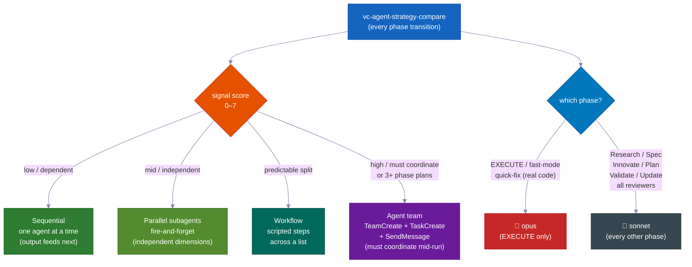

> ⚠️ **"Agent team" means the real machinery** — named teammates, a shared task list, and inter-agent messaging — *not* bare parallel agents called a "team." It is **required** (not optional) for creating 3+ phase plans and for multi-file edits where agents must each stay in their own files. Only a true team can communicate while running.

### 🧮 Model selection policy

| Phase | Model | Why |
|---|---|---|
| **EXECUTE** (+ fast-mode, quick-fix doing real code) | 🔴 **opus** | Real source edits, builds, migrations |
| Research · Spec · Innovate · Plan · Validate · Update · all reviewers/researchers | 🔵 **sonnet** | Planning and analysis — cheaper, plenty capable |

> When work is split across several agents, only the *coding* agent uses opus. Every reviewer, researcher, validator, and planner uses sonnet. The lead agent names the model each time it spawns a worker.

---

## 🤖 Autopilot Mode — Hands-Free RIPER-5

Say **`autopilot [task]`** (or `run autopilot`, `autonomous mode`, `ENTER AUTOPILOT MODE`) and the agent runs the *entire* remaining RIPER-5 sequence with **one** clarification round up front — then no more pauses until it is done.

**Trigger anywhere:** autopilot can start at the beginning of a session *or* at any point mid-session. On trigger, the lead agent reads the saved files on disk to figure out which RIPER-5 phase you are already in, then picks up from there and drives the rest on its own.

| On-disk state | Entry phase |
|---|---|
| No SPEC file | Start at RESEARCH |
| SPEC file present | Skip to post-SPEC (INNOVATE) |
| Plan file present | Skip to post-PLAN (VALIDATE) |
| Validate-contract with PASS/CONDITIONAL | Skip to EXECUTE |

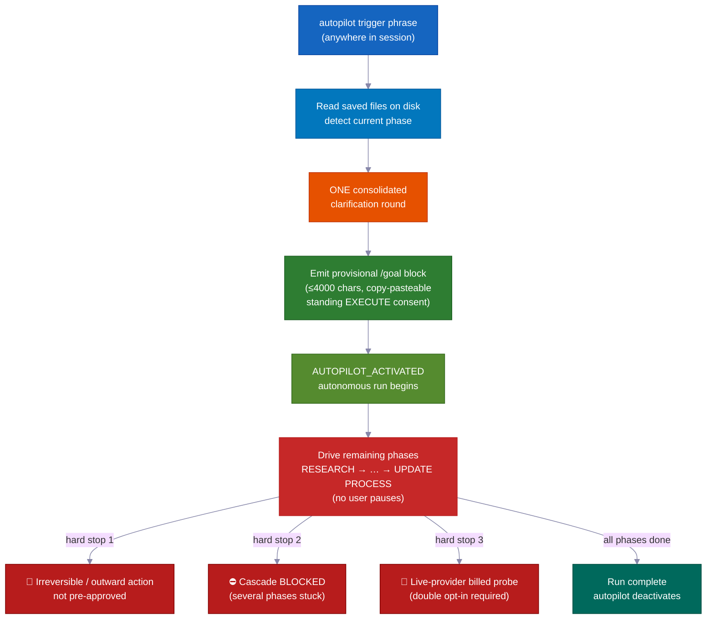

```
You: "autopilot full: add team invitations with email + role management"
→ Reads saved files → detects current phase → enters there
→ ONE consolidated clarification round (scope, hard stops, autonomy boundaries, first-phase strategy)
→ Provisional /goal block emitted (≤4000 chars, copy-pasteable, standing EXECUTE consent)
→ AUTOPILOT_ACTIVATED → drives remaining phases on its own
→ Stops ONLY for hard stops
```

### Three lanes — match ceremony to risk

| Lane | Trigger | Flow |
|---|---|---|
| 🟢 **quick** | `autopilot quick: [task]` | Scout → edit → scoped check. No plan, no contract, no EVL. |
| 🟡 **fast** | `autopilot fast: [task]` | Compressed R→S→I→P→V → EXECUTE + EVL. |
| 🔴 **full** | `autopilot [task]` / `autopilot full:` | Complete RIPER-5 (default). |

### 🌙 Hands-Free: One Phrase, Built While You Sleep

Say `autopilot full: [task]` — or paste a `/goal` block — and the following all happen with **zero human input**:

- **Plan-check-and-fix loop** — finds gaps in the plan, fixes them, and re-checks. Up to 10 rounds on its own.
- **Build-test-and-fix loop** — writes code, runs tests, fixes failures, re-runs. Up to 10 rounds on its own. It never trusts its own "all green" — a separate checker (vc-tester) independently re-runs every test to confirm.
- **Phase-to-phase advancement** — moves from research to plan to code to done without waiting for you.
- **Picks up after a memory reset** — plans, reports, and progress all live as files on disk. After compaction (when the AI's short-term memory clears), the next session reads those files and continues exactly where it left off.
- **Stuck feature? Set it aside, keep going** — if one phase can't be resolved, the agent writes a backlog note and moves on to the next feature. You can run many features in parallel without one blocker stopping everything.
- **Teams of agents for parallel features** — multiple agents can build separate features at the same time, each locked to its own files so they never collide. A stuck feature is parked, not a blocker for the rest.

### Hard stops always surface (even on autopilot)

These are the **only three times it stops and asks you**:

- 🛑 Anything it cannot undo, or that reaches the outside world and was not pre-approved (going live, sending real messages, charging money)
- ⛔ Several phases in a row get stuck with no progress — a real dead-end worth your eyes
- 💸 A test that would spend real money on a paid outside service — it asks before running

---

### 🎯 /goal — the autonomous run token

**Required, not decoration:** after every VALIDATE phase completes, the lead agent *must* emit a copy-pasteable `/goal` block before EXECUTE starts. This is a required handoff file — not optional commentary.

**Format constraints:**

| Block type | Required fields | Hard limit |
|---|---|---|
| Post-VALIDATE block | SESSION GOAL · Charter+umbrella plan · Autonomy · Hard stop conditions · Next phase · Validate contract · Execute start | ≤ 4000 chars |
| Provisional (autopilot) block | SESSION GOAL · ENTRY PHASE · REMAINING PHASES · CLARIFICATIONS LOCKED · EXECUTE CONSENT · DECISION POLICY · HARD STOPS · TEST GATES · START (+ optional LANE) | ≤ 4000 chars |

The `/goal` command rejects blocks longer than 4000 characters. Keep it short — use the required fields as the structure, not a prose essay.

**Standalone /goal mode:** paste a `/goal` block into a new session and the run picks up from the phase named in `START`. Clarifications and decision rules are already set — no new clarification round. Under a standing `/goal`, the agent decides on its own at every reversible step, sends BLOCKED items to a backlog, and writes its own reports — but **worker agent delegation stays mandatory.** Autopilot removes *approval pauses* only, never the no-inline-execution rule.

Validated by `validate-autopilot-goal-block.mjs`.

---

## 🔬 Feasibility Probes + The Validator Safety Net

### 🔬 Feasibility probes — test the assumption before building on it

When SPEC, INNOVATE, or VALIDATE hits a key assumption it cannot confirm by reading alone, it emits `VC-FEASIBILITY-PROBE-NEEDED` and stops. The lead agent spawns `vc-debugger` to run a real test and write a **VERDICT**:

| Verdict | Meaning |
|---|---|
| ✅ **VIABLE** | Assumption holds — design may rely on it |
| ❌ **NOT-VIABLE** | Assumption is false — that approach is forbidden |
| ❓ **INCONCLUSIVE** | Couldn't prove it — carried forward as a known-gap |

Each verdict comes with a 3-part design note: **what the result allows · what it rules out · what is still uncertain** — fed word-for-word back into the paused phase. Probes are **cost-classed** (`cheap-local` / `needs-container` / `needs-live-provider` → double opt-in / `needs-browser` / `needs-cf`) so a billed or shared-resource probe never runs silently.

### 🛡️ 36 validators — mechanical correctness, not opinion

The kit ships **36 validator scripts** that turn "did the agent follow the rules?" into a clear pass/fail result. They run after any phase that touches harness files, and as required checkpoints in UPDATE PROCESS:

| Validator family | Checks |
|---|---|
| `vc-audit-vc` | Agent parity (Claude/Codex), skill registry, kit portability, agent frontmatter |
| `vc-audit-context` | Context routing, discovery frontmatter, skill keywords |
| `vc-audit-plans` | Plan inventory, umbrella state, phase completeness, phase reports, backlog notes |
| 14 VC-system behavior validators | Each owns a pass/fail fixture pair — strategy-compare output, closeout, intent-clarify, feasibility verdict, autoresearch log, and more |

---

## 🛡️ Built-in Safety Systems

These are not guidelines — they are **hard rules** built into every agent.

<table>
<tr>
<td width="50%" valign="top">
<h1>📝</h1>
<strong>Progress Notes, Not Mid-Run Pauses</strong><br><br>
During coding the agent writes progress notes to the phase report file as it works. No mid-run pause, no "continue or return?" prompt. If it hits a problem that needs a plan change, it stops and returns to PLAN. Otherwise it keeps going.
</td>
<td width="50%" valign="top">
<h1>🚫</h1>
<strong>Never Quietly Deviate</strong><br><br>
If coding hits a problem that needs a plan change, the agent <strong>stops immediately</strong>, explains, and returns to PLAN. No silent improvising.
</td>
</tr>
<tr>
<td width="50%" valign="top">
<h1>🔐</h1>
<strong>Privacy Guardrails Hook</strong><br><br>
The agent is <strong>blocked from reading</strong> <code>.env</code>, credentials, SSH keys, and <code>.pem</code> files without explicit approval.
</td>
<td width="50%" valign="top">
<h1>⚠️</h1>
<strong>High-Risk Evidence Packs</strong><br><br>
For auth, billing, schema migrations, or public-API changes, the system requires a formal <strong>5-file evidence pack</strong> before calling work "done" — always manual, never auto-bypassed.
</td>
</tr>
<tr>
<td width="50%" valign="top">
<h1>📨</h1>
<strong>Status-Code Discipline</strong><br><br>
Worker agents must close with <code>DONE</code> / <code>DONE_WITH_CONCERNS</code> / <code>BLOCKED</code> / <code>NEEDS_CONTEXT</code>. Blockers are never ignored; correctness concerns become action items.
</td>
<td width="50%" valign="top">
<h1>📊</h1>
<strong>Closeout + Drift Scoring</strong><br><br>
After coding, a closeout packet scores urgency: <strong>LOW</strong> (light touch) → <strong>MEDIUM</strong> (significant) → <strong>HIGH</strong> (harness/protocol files touched), and recommends the next safe step.
</td>
</tr>
</table>

---

## 🔍 Pre-Implementation Intelligence

Before a single line of code is written, three specialist skills can catch issues:

<table>
<tr>
<td width="50%" valign="top">
<h1>🎭</h1>
<strong>5-Persona Debate — <code>vc-predict</code></strong><br><br>
Architect, Security, Performance, UX, and Devil's Advocate debate your plan. Produces a <strong>GO / CAUTION / STOP</strong> verdict before you write a line.
</td>
<td width="50%" valign="top">
<h1>🎲</h1>
<strong>12-Dimension Edge Cases — <code>vc-scenario</code></strong><br><br>
Decomposes a feature across 12 dimensions (user types, input extremes, timing, scale, state, env, errors, auth, data, integrations, compliance, business logic). Output doubles as test specs.
</td>
</tr>
<tr>
<td width="50%" valign="top">
<h1>🔐</h1>
<strong>STRIDE + OWASP Audit — <code>vc-security</code></strong><br><br>
Dual-methodology security audit with dependency auditing, secret detection, and an <strong>auto-fix mode</strong> that sorts by severity and fixes Critical first with regression guards.
</td>
<td width="50%" valign="top">
<h1>🔬</h1>
<strong>Evidence-First Debugging — <code>vc-debugger</code></strong><br><br>
Gathers evidence → forms 2-3 competing hypotheses → tests each → documents the elimination path. <strong>Never guesses — proves.</strong>
</td>
</tr>
</table>

---

## ✅ Quality Pipeline — Built Into Execution

**Tests first, then code.** The agreed checklist (written before any code is touched) defines the exact tests that must pass. The execute-agent writes code until those tests go green. Then a separate checker — `vc-tester` — re-runs every test on its own to confirm. The execute-agent's own "all green" is never taken at face value. At the very end, the reviewer checks that the whole project still works together, not just the new piece.

The execute-agent does not just write code and call it done. It moves through a **quality pipeline** automatically:

<br>

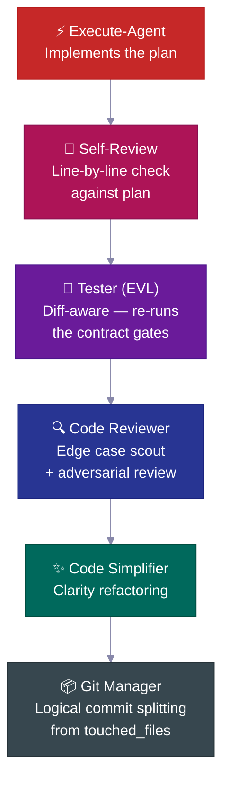

| Step | What it does |
|---|---|
| 🔎 **Self-review** | Checks every checklist item against the plan, records any deviation |
| 🧪 **Tester (EVL)** | Re-runs the agreed-checklist tests independently; maps changed files → test files, escalates to the full suite when >70% mapped |
| 🔍 **Code reviewer** | Sends an edge-case scout *before* review; checks N+1 queries, auth paths, data leaks |
| ✨ **Simplifier** | Tidies the code for clarity after review — no behavior changes |
| 📦 **Git manager** | Receives `touched_files`, splits into logical conventional commits, refuses unknown files |

---

## 📋 The Plan Lifecycle

Every non-trivial feature follows a **plan lifecycle** — a written spec that is created, reviewed, built against, and then archived as permanent project history.

<br>

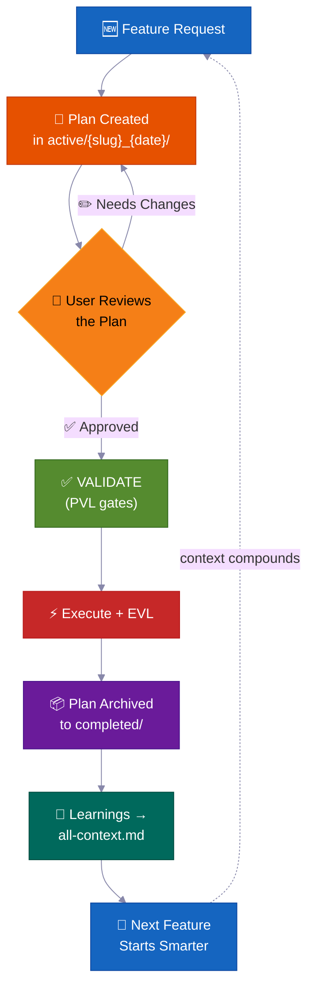

> 💡 Six months from now, when someone asks *"why did we build auth this way?"*, the answer is in `completed/`. Not lost in a Slack thread.

**Where plans live — task-folder convention:**

```
process/
├── general-plans/
│   ├── active/
│   │   └── webhooks_28-05-26/          # 📋 Task folder: plan + colocated reports/refs
│   │       └── webhooks_PLAN_28-05-26.md
│   ├── completed/                       # ✅ Archived (searchable history)
│   └── backlog/                         # 📌 Deferred work
└── features/
    └── billing/                         # 🏷️ Feature-scoped (5+ artifacts)
        ├── active/{slug}_{date}/
        ├── completed/
        └── backlog/
```

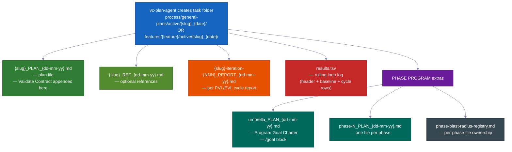

> Every plan carries: 📍 **touchpoints** (files created/modified) · 📜 **public contracts** · 💥 **which files it can touch** (what could break, what to test) · ✅ **verification evidence** · 🔄 **resume handoff**. `vc-plan-discovery` finds the right plan to resume; the `post-write-plan-check` hook checks plan structure on every plan write.

---

## 🏗️ Phase Programs — Large Projects That Don't Fall Apart

Normal features use one plan. **Large multi-phase projects** use a phase program — an umbrella plan plus per-phase plans, each running a full **7-step inner loop** with its own checkpoints and a saved report.

<br>

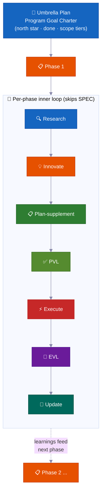

| | Feature | Why it matters |
|---|---|---|
| 🔄 | **Re-research at every phase** | Checks for code drift, reads latest reports, refreshes assumptions |
| ✅ | **Checkpoints per phase** | A phase is not done until evidence proves it. Honest status: `PLANNED → CODE DONE → TESTING → VERIFIED` or `BLOCKED` |
| 📄 | **Saved reports** | Every phase writes results to disk — progress survives a memory reset |
| 🧠 | **Learnings feed forward** | Phase 1 discoveries update Phase 2's plan before coding starts |
| 🏗️ | **Foundation vs expansion** | Explicitly separates "prove the architecture" from "implement everything" |
| 🚧 | **Honest blocker handling** | Stuck phases stay `BLOCKED` with evidence. No faking a green status |

<br>

### 🔀 The program reshapes itself as it learns

The plan you write at the start is a rough map, not a fixed contract. As the program runs, it adjusts — so you do not have to predict every step in advance.

**It can add a new phase in the middle of a run.**
While working, the agent may discover a missing step — something that must happen before the next phase can proceed. When that happens, it inserts a new phase right there, renumbers the rest, and carries on. No human needed. (Internal signal: `MID_PROGRAM_PLAN_CREATED` — the new plan is written to disk and added to the registry automatically.)

**It can reorder phases.**
Research sometimes shows the planned order is wrong — for example, Phase 3 depends on something only Phase 4 produces. The agent rearranges the remaining phases and records why. (Internal signal: `PHASE_RESTRUCTURE_NOTICE` — saved in the phase report as an audit trail, not a blocker.)

**It updates each phase's own plan right before coding it.**
Before any phase starts coding, a quick research pass reviews what the program has learned so far. It then updates that phase's checklist with new findings. This is called a **plan-supplement** step. Plans are never frozen — they absorb fresh facts from earlier phases.

**It skips work that cannot start yet.**
If a phase depends on something not yet ready — a service not yet built, a decision not yet made — the agent marks that phase as dependency-blocked, sets it aside, and moves on to the next one. The whole program does not stall because one phase is waiting.

**It knows when to stop and ask.**
A single stuck phase just gets parked in a backlog and the program continues. But if several phases in a row hit a wall with no progress, the agent treats that as a real dead-end — a **cascade stop** — and pauses to show you what happened. One stuck phase is normal. Several in a row signals something structural is wrong.

**It keeps a live scoreboard.**
Every program has a one-page status section in the umbrella plan showing which phase is current, whether it is done, and where the report lives. Anyone — or the agent itself after a memory reset — can read it and know exactly where things stand. It also keeps a simple file registry so two phases working at the same time never edit the same files.

**One big final check.**
At the end of the whole program, the agent runs an end-to-end test that the entire project still works together — not just each piece on its own. Individual phase checkpoints prove each part works; this final check proves the parts work as a whole.

---

### 🧠 It Never Loses Its Place (Survives a Memory Reset)

Long jobs finish correctly — even when the AI's memory resets mid-way. The plan, the progress, and the proof all live in files on disk, not only in the agent's head.

AI agents have a limited working memory. On a long job that memory fills up and gets squeezed down — details can blur. When a new session starts (or memory is cleared), the agent does not guess where it left off. It reads the files.

Here is exactly how that works:

**1. It writes a short report after every phase.**
When a phase finishes, a report file is written to disk. Progress lives in your project folder, not just in the agent's head. A memory squeeze cannot erase a file.

**2. It keeps a checklist of which steps are done.**
Each phase plan holds a **Phase Loop Progress** list — tick-boxes for every step (research, plan-check, build, test, capture learnings). After a reset, the agent reads those boxes and knows the exact next step. No need to catch it up.

**3. A brief "envelope" at the start of every phase.**
Every worker agent (a focused helper that does one phase of work) opens by emitting a **Context Envelope** — a 10-field note: which feature, which phase, which branch, which plan file, which tests to run. It takes seconds to read. The agent is ready before it does anything.

**4. It trusts the files over its own memory.**
On resume, the agent checks what is actually in the code and git history versus what the plan says. The real state wins. A plan that went stale cannot mislead the agent into repeating work or skipping steps.

**5. A running scoreboard and per-round reports.**
Every fix loop (the plan-check loop and the build-test loop) keeps a `results.tsv` scoreboard file — one row per round, tracking how many issues remain. When a session ends mid-loop, the next session reads the count, picks up at the right round, and continues. No rounds are lost.

**6. It re-injects a reminder on resume.**
When memory is squeezed, the system automatically reloads the latest status note into the new session. If any approval was pending — say, a checkpoint that needed a "yes" before moving on — the reminder flags it. Nothing is silently skipped.

> 💡 In short: you can start an autopilot run, close your laptop, and come back hours later. The agent will be exactly where it should be — or will pick up from the last saved checkpoint, with evidence on disk to prove it.

---

## 🧠 Context Groups

Project knowledge is organized into **context groups** — stable knowledge areas, each with an `all-{group}.md` router file that tells agents what to read and when. Agents follow the router, loading only what is relevant — not the whole knowledge base every time.

<br>

```
process/context/
├── all-context.md              # 🧭 Root router — architecture, stack, patterns, conventions
├── tests/all-tests.md          # 🧪 Test runners, commands, debugging procedures
├── container/all-container.md   # 🐳 Docker, deployment, infra procedures
├── uxui/all-uxui.md            # 🎨 Components, design tokens, patterns
├── infra/all-infra.md          # 🖥️ Server infrastructure, deployment
└── {your-domain}/all-{domain}.md  # 📚 Any domain with 3+ durable docs (auto-promoted)
```

| | How it works |
|---|---|
| 🧭 **Router pattern** | Agents read only what is relevant to their task |
| 📏 **Auto-promotion** | Topics with 3+ docs (or a single file that gets too large) get their own group |
| 🔄 **Always current** | Updated by `vc-update-process-agent` after every non-trivial feature |
| 🧪 **Auditable** | `vc-audit-context` checks routing, discovery frontmatter, and consistency |
| 📨 **Context Envelope** | Every inner-loop agent emits a 10-field note at start (feature → phase → session-goal → branch → worktree → context-group → blast-radius-packages → active-plan → test-runner → validate-contract) so a fresh worker agent knows exactly where it stands |

> The kit ships only the protocol seed — your context groups are **built for your project** by `vc-setup`, scanning your real code. They are a pattern, not a fixed list.

---

## 📁 Feature Folders

When a topic builds up 5 or more files, it gets its own **feature folder** — a complete lifecycle container.

```
process/features/{feature}/
├── active/{slug}_{date}/   # 📋 Plans being worked on (reports/refs colocated)
├── completed/              # ✅ Archived plans (searchable decision history)
└── backlog/                # 📌 Deferred work (agents check before duplicating)
```

| | What happens |
|---|---|
| 🆕 | New work starts in `active/` → reports accumulate → plan archives to `completed/` |
| 📌 | Deferred work goes to `backlog/` — agents check it before creating duplicate plans |
| 📦 | Feature promotion happens automatically when general artifacts hit 5+ |
| 🔍 | Every feature has complete, self-contained history — plans, decisions, reports, research |

---

## 🧱 Skill Layers

The 33 skills fall into three layers. Every `SKILL.md` declares its `layer` + `trigger_keywords` in frontmatter, and a generated catalog keeps discovery fast.

<table>
<tr>
<td width="33%" valign="top">
<h1>🎭</h1>
<strong>Actor agents</strong><br><br>
Own a phase or role. Live in <code>.claude/agents/</code> — these are the 15 agents, not skills.
</td>
<td width="33%" valign="top">
<h1>📜</h1>
<strong>Contract skills (20)</strong><br><br>
Each one produces a specific file or agreed output — <code>vc-generate-plan</code>, <code>vc-validate-findings</code>, <code>vc-autopilot</code>, the audits. Results can be checked.
</td>
<td width="33%" valign="top">
<h1>🛠️</h1>
<strong>Helper skills (13)</strong><br><br>
Improve <em>how</em> agents work, produce no file of their own — <code>vc-scout</code>, <code>vc-sequential-thinking</code>, <code>vc-problem-solving</code>, <code>vc-docs-seeker</code>.
</td>
</tr>
</table>

---

## 🧠 Self-Improving Project Memory

Every completed feature feeds learnings back into the context system — **the knowledge builds up, it does not reset.**

Most AI-assisted codebases have the opposite property: every new session starts cold. The agent re-reads the same files, re-discovers the same patterns, and re-makes the same decisions — because the last session's insight lived only in a chat window. The kit's answer is not a prompt trick. It is a **durable context-file system** (`process/context/`) that every agent reads at session start, every validator protects, and every completed feature enriches.

Six months and many memory resets later, the agent still knows *why* your auth works the way it does — because that knowledge is on disk, routed, and auditable, not trapped in a dead session.

<br>

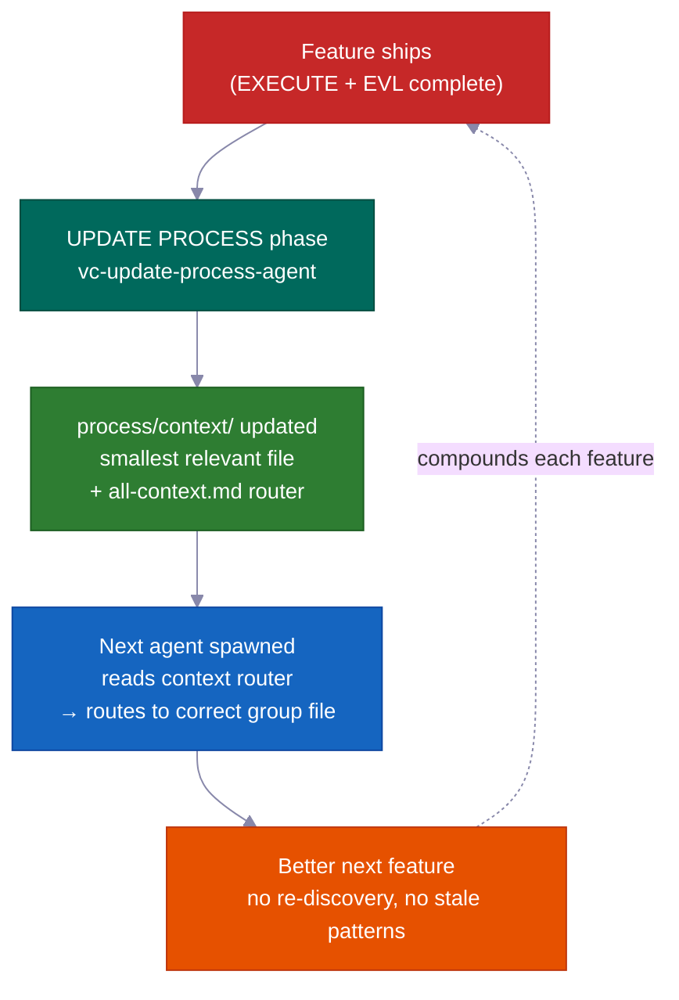

### The core mechanism: `process/context/` as portable, shared memory

`process/context/` holds structured knowledge organized into topic groups — architecture decisions, coding conventions, deployment steps, test patterns, infrastructure facts. Unlike a chat history, this knowledge:

- **travels into every worker agent** — `vc-context-discovery` routes each spawned agent to the right `all-{group}.md` router for its task, then to the smallest relevant deep file. A research agent, a plan agent, and a coding agent all start with the same shared understanding
- **survives a memory reset** — it is on disk, not in a context window; a squeezed session loses none of it
- **is readable by both Claude and Codex** — `.agents/skills` is a shortcut link to `.claude/skills/`, so the same context system serves both agents without duplication

The root router (`all-context.md`) points to group routers (`all-{group}.md`), which route to the smallest relevant deep file. Agents follow the router — they never hard-code file paths. This means renames and group splits require only router edits, not a codebase-wide search.

```
process/context/
├── all-context.md                  ← root router (architecture, stack, patterns)
├── tests/all-tests.md              ← test runners, debugging, commands
├── container/all-container.md      ← Docker, deployment, infra procedures
├── uxui/all-uxui.md                ← components, design tokens, visual conventions
└── {domain}/all-{domain}.md        ← any domain with 3+ durable docs (auto-promoted)
```

<br>

### What makes it self-improving (not just "living docs")

The phrase "living docs" usually means "docs we intend to keep up to date but mostly forget." This system enforces the intention mechanically.

**The UPDATE PROCESS phase requires a per-file context review before it can close.** `vc-update-process-agent` cannot finish a phase until every potentially-affected context file has been reviewed with a concrete reason per file. "No updates needed" is allowed — but it must name each reviewed file and explain why. Vague reasons are rejected. The checkpoint is binary: record the review, or the phase does not close.

The full feedback loop per completed feature:

| Step | Owner | What happens |
|------|-------|-------------|
| 1. Git diff analysis | `vc-scout` | Maps changed files → affected context areas |
| 2. Per-file review | `vc-update-process-agent` | Names each context file, states the update or an explicit "no change + reason" |
| 3. Updates applied | parallel worker agents | Each area's context file is updated with new patterns, decisions, learnings |
| 4. Routing verified | `validate-context-discovery.mjs` | Confirms every doc is indexed and routers are consistent |
| 5. Discovery confirmed | `validate-all-context.mjs` | Confirms `all-context.md` and group routers match the current files on disk |

Your 100th feature benefits from everything learned in the first 99 — not as an aspiration, but as a mechanical guarantee.

<br>

### Forward Preview: learnings feed forward, not just backward

Every phase report carries a `## Forward Preview` section written for the *next* phase's agent. It gives the exact commands to keep green, dependency changes, and file-scope changes found mid-phase. The agent picking up Phase 3 does not have to re-read Phase 2's output and guess what matters. It is handed a focused brief.

This is different from context docs: context docs carry *lasting* knowledge (decisions that stay true across features); Forward Preview carries *temporary* handoff state (what the next work session needs to know right now).

<br>

### Validator suite prevents rot

Lasting knowledge goes stale when nobody checks it. The kit ships validators that run as part of every phase closeout:

| Validator | What it catches |
|-----------|----------------|
| `validate-context-discovery.mjs` | Docs not indexed by any router; broken links; missing frontmatter |
| `validate-all-context.mjs` | `all-context.md` out of sync with actual files on disk |
| `validate-skill-keywords.mjs` | Skills missing `trigger_keywords` or `layer` fields (breaks routing Step 0) |
| `validate-protocol-discovery.mjs` | Protocol files in `process/development-protocols/` missing discovery frontmatter |

These run like automated checks — a stale or orphaned doc fails. The system polices its own health.

<br>

### Context groups self-organize

Groups are created automatically when a topic reaches 3+ docs or a single file goes past ~800 lines. Agents follow routers and never hard-code paths — so adding a new group (e.g. `process/context/billing/all-billing.md`) requires only a router update, not changes to every agent that mentions billing. The router is the stable reference; the files behind it can reorganize freely.

> The kit seeds context groups from your real codebase (via `vc-setup`). The groups are not a fixed list — they are a pattern. Your auth area, your infra area, your payments area each become first-class routable knowledge as the project grows.

---

## 🤖 What's Inside

<br>

### 15 Agents

<details>
<summary>Click to expand the agent roster</summary>

<br>

**Core workflow agents** — one per RIPER-5 phase (R → SPEC → I → P → V → E → UP):

| Agent | Model | Role |
|-------|:---:|------|
| 🔍 `vc-research-agent` | sonnet | Codebase + web research, read-only. Contradiction tracking built in |
| 📝 `vc-spec-agent` | sonnet | Product-discovery requirements doc before INNOVATE. Produces `*_SPEC_*.md` |
| 💡 `vc-innovate-agent` | sonnet | Compare 2-3 approaches. Decision summary (chosen + rejected) before PLAN |
| 📋 `vc-plan-agent` | sonnet | Write the plan with anti-shortcut guards. "I already know how" is not a plan |
| ✅ `vc-validate-agent` | sonnet | Turn plan → agreed checklist (V1–V7). Checkpoint: PASS/CONDITIONAL/BLOCKED |
| ⚡ `vc-execute-agent` | **opus** | Implement per plan. Progress notes to phase report, deviation protocol, self-review |
| ⏩ `vc-fast-mode-agent` | **opus** | Compressed R→S→I→P→V with a required safety pause before EXECUTE |
| 🔧 `vc-quick-fix-agent` | **opus** | QUICK FIX lane: one small low-risk edit + scoped check, no plan/validate |
| 🧠 `vc-update-process-agent` | sonnet | 7-phase closeout: archive, update context, stale-artifact scan, learnings |

<br>

**Specialist agents** — called during EXECUTE or standalone:

| Agent | Role |
|-------|------|
| 🐛 `vc-debugger` | Gathers evidence before forming a hypothesis. Competing hypotheses, elimination chains, feasibility probes |
| 🧪 `vc-tester` | Change-aware. Re-runs agreed-checklist tests (EVL). Auto-escalates on config changes |
| 🔎 `vc-code-reviewer` | Sends an edge-case scout BEFORE review. N+1 detection, auth-path checking |
| ✨ `vc-code-simplifier` | Tidies code for clarity without changing behavior |
| 🎨 `vc-ui-ux-designer` | Design-aware frontend. Can spawn a research worker mid-build |
| 📦 `vc-git-manager` | Splits into logical commits from `touched_files`. Refuses unknown files |

</details>

<br>

### 33 Skills (auto-discovered)

<details>
<summary>Click to expand the skill list (20 contract + 13 helper)</summary>

<br>

**📜 Contract skills (20)** — own an artifact: `vc-generate-plan` · `vc-generate-context` · `vc-generate-spec` · `vc-generate-closeout` · `vc-generate-phase-program` · `vc-audit-context` · `vc-audit-plans` · `vc-audit-vc` · `vc-update` · `vc-publish` · `vc-feasibility-test` · `vc-risk-evidence-pack` · `vc-test-coverage-plan` · `vc-validate-findings` · `vc-autoresearch` · `vc-intent-clarify` · `vc-autopilot` · `vc-agent-strategy-compare` · `vc-plan-discovery` · `vc-context-discovery`

**🛠️ Helper skills (13)** — improve how agents work: `vc-review-situation` · `vc-sequential-thinking` · `vc-problem-solving` · `vc-scout` · `vc-debug` · `vc-docs-seeker` · `vc-frontend-design` · `vc-agent-browser` · `vc-web-testing` · `vc-setup` · `vc-predict` · `vc-scenario` · `vc-security`

</details>

> **⚠️ Naming rule:** Do NOT use the `vc-` prefix for your own skills or agents — that namespace is reserved for kit-shipped files, and the stale-removal guard treats any `vc-*` path under `.claude/skills/` and `.claude/agents/` as kit-owned. Use `my-`, `team-`, or `proj-` instead.

<br>

### 🪝 10 Hooks

| Hook | What it does |
|------|-------------|
| 🔐 `privacy-block.cjs` | Blocks reading `.env`, credentials, SSH keys. Requires explicit approval |
| 🚫 `scout-block.cjs` | Prevents wandering into `node_modules/`, `dist/`. Gitignore-syntax `.ckignore` |
| 🧠 `session-init.cjs` | Detects stack, injects env, recovers approval gates after compaction |
| 💉 `subagent-init.cjs` | Injects a compact context block into every subagent |
| ✨ `post-edit-simplify-reminder.cjs` | After 5+ edits, nudges to run the simplifier (non-blocking, throttled) |
| 📛 `descriptive-name.cjs` | Language-aware file-naming conventions on every Write |
| 📊 `session-state.cjs` | Session metrics + token awareness |
| 📋 `post-write-plan-check.mjs` | Validates plan-artifact structure on every Write to a `*_PLAN_*.md` |
| 🧹 `post-commit-lint.mjs` | Checks conventional-commits prefix on every `git commit` |
| 🔍 `stop-validator-sweep.cjs` | Runs core harness validators when the session stops |

<br>

**Where everything lives:**

```text
your-project/
├── .claude/{agents,skills,hooks}/   # 🤖 15 agents · ⚡ 33 skills · 🪝 10 hooks
├── .codex/agents/                   # 🔄 Mirrored for Codex
├── .agents/skills -> .claude/skills # 🔗 Symlink for Codex discovery
├── CLAUDE.md · AGENTS.md            # 📋 Orchestrator config + cross-tool registry
└── process/
    ├── context/                     # 🧠 Auto-routed knowledge domains
    ├── general-plans/               # 📋 Cross-cutting plans + task folders
    ├── features/                    # 🏷️ Feature-scoped lifecycle folders
    └── development-protocols/       # 📜 22 shared workflow docs
```

---

## ⚡ Quick Fix + Fast Mode

Two lighter options for when the full RIPER-5 process is more than the job needs:

<table>
<tr>
<td width="50%" valign="top">
<h1>🔧</h1>
<strong>Quick Fix</strong> — <code>"quick fix: …"</code><br><br>
Bigger than a trivial one-liner, smaller than "needs a plan." The lead agent scouts read-only → one-line confirm → spawns <code>vc-quick-fix-agent</code> for the edit + a scoped check on touched files only. <strong>No plan, no agreed checklist, no EVL.</strong>
<br><br>
<sub>Cancelled immediately if the change touches schema, auth, API, billing, or migration surfaces — then it routes to full RESEARCH.</sub>
</td>
<td width="50%" valign="top">
<h1>⏩</h1>
<strong>Fast Mode</strong> — <code>"ENTER FAST MODE - …"</code><br><br>
Squeezes RESEARCH + SPEC + INNOVATE + PLAN + VALIDATE into one pass — but still <strong>writes a plan, writes an agreed checklist, and pauses before EXECUTE.</strong>
<br><br>
<sub>In plain Fast Mode, there is a post-VALIDATE pause — you review, then say "ENTER EXECUTE MODE." Use <code>autopilot fast: [task]</code> to remove that pause and run all the way through without stopping.</sub>
</td>
</tr>
</table>

---

## 🔄 Kit Lifecycle: Install · Setup · Update · Publish

| Command | What it does | When |
|---|---|---|
| `curl … install.sh \| bash` | Syncs kit files without overwriting yours; auto-detects fresh vs upgrade and routes you | First install + every upgrade |
| **Run vc-setup** | Detects stack, scaffolds `process/`, deep-scans codebase, populates real context | After a fresh install |
| **Run vc-update** | Computes a precise diff, shows what will change, waits for your OK; migrates old-format plans/folders with zero data loss | On every upgrade |
| **Run vc-publish** *(maintainers)* | Publishes harness changes back out to the kit repo | Contributing to the kit itself |

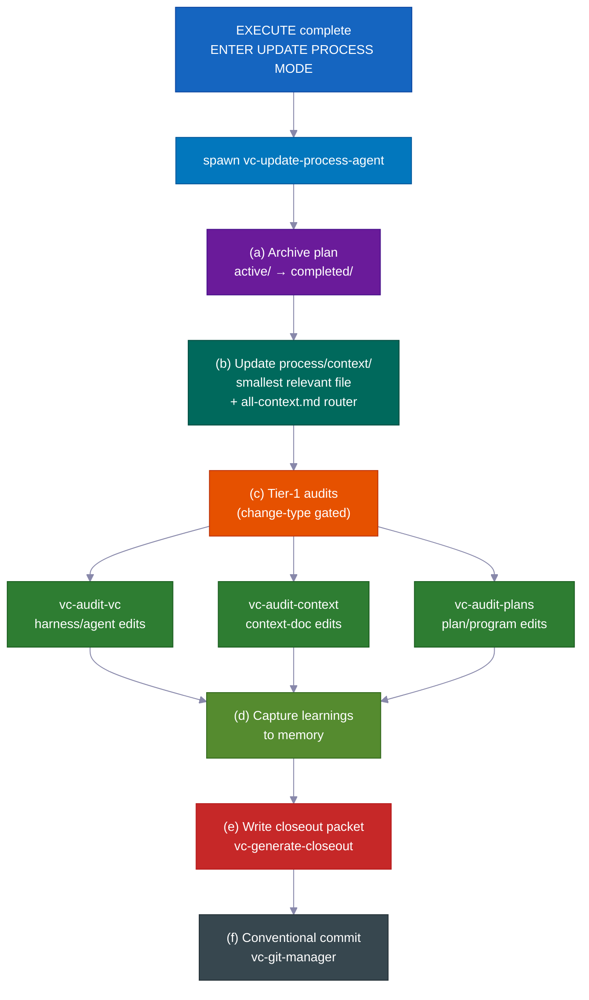

> 💡 `vc-update` shows a preview diff and waits for your OK. Your `process/` directory and project-specific content are **never** silently changed. Re-running install is safe to run twice.

---

## 💡 More Reasons It Just Works

Many small, smart defaults add up to less babysitting and lower cost.

- **Each role only gets the tools it needs.** During planning, the agent literally cannot edit code — those tools are turned off. This stops the agent from jumping ahead and changing things before the plan is approved. The system simply does not allow it.

- **It uses the premium AI model only where it matters.** Code-writing uses the top model. Planning, research, review, and checking all use a cheaper, faster model. The result: roughly 60–70% lower cost compared to running the top model for everything — with no quality loss on the work that counts.

- **It tests risky guesses before building on them.** When the agent is not sure something will work — a specific API behavior, a library feature, an infrastructure assumption — it runs a tiny real experiment first. The result is clear: works, does not work, or unclear. That verdict and a plain-English note get fed straight into the plan. The agent does not spend hours building on a wrong assumption.

- **Tidy, meaningful save points.** Changes are committed in clean, logical chunks with clear messages — automatically. The history is easy to read and easy to undo one piece at a time.

- **Helpful automatic reminders.** Small built-in helpers nudge for things like running the right checks on changed files, keeping code simple, and writing a proper commit message. Quality stays high without you having to police it.

- **You can run the self-improving loop on its own.** The same "find problems, fix them, repeat" engine that drives plan-checking and test-fixing also works as a standalone tool on any messy area — a spec, the docs, the tests, an error list. You do not need a full feature build to use it.

- **Built-in proof the workflow rules actually work.** The kit ships with its own test suite: a set of checks with known-good and known-bad examples that prove the workflow rules behave correctly. The system checks itself. You do not have to trust that the guardrails are on — you can run the checks and see.

---

## Contributing

We welcome contributions! See [CONTRIBUTING.md](CONTRIBUTING.md) for guidelines.

<br>

**Quick links:**

- 🐛 [Report a bug](https://github.com/withkynam/vibecode-pro-max-kit/issues/new?template=1.bug_report.yml)
- 💡 [Request a feature](https://github.com/withkynam/vibecode-pro-max-kit/issues/new?template=2.feature_request.yml)
- ⚡ [Submit a skill](https://github.com/withkynam/vibecode-pro-max-kit/issues/new?template=3.skill_submission.yml)
- 🌐 [Add a translation](https://github.com/withkynam/vibecode-pro-max-kit/issues/new?template=5.translation.yml)

<br>

<a href="https://github.com/withkynam/vibecode-pro-max-kit/graphs/contributors">
  
</a>

<br>

### 🙏 Credits

vibecode-pro-max-kit focuses on the spec-driven development framework and self-improving context organization, without bloating you with 80+ skills. Fewer tools, more structure.

---

## ⭐ Star History

<a href="https://star-history.com/#withkynam/vibecode-pro-max-kit&Date">
 <picture>
   <source media="(prefers-color-scheme: dark)" srcset="https://api.star-history.com/svg?repos=withkynam/vibecode-pro-max-kit&type=Date&theme=dark" />
   <source media="(prefers-color-scheme: light)" srcset="https://api.star-history.com/svg?repos=withkynam/vibecode-pro-max-kit&type=Date" />
   
 </picture>
</a>

---

## 📄 License

MIT
